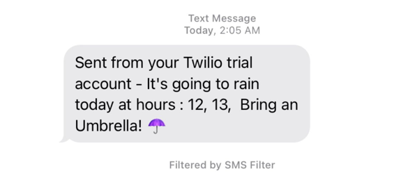

# Rain-Alert
bunnysaini/Rain-Alert

## Features
This program sends a message on your mobile number to notify you of anticipated rain chances.

## Instructions to Use
- Create a Trial Account on [Twilio](https://www.twilio.com/) - to Send and receive messages with Messaging APIs
- Generate a Twilio Number (Sender Number), API Key, Auth Token, Account SID and replace them in main.py
- Enter Your mobile number (Reciever Number) in main.py
- Find out your local latitude and longitude using LatLong.net or any other services and enter them in main.py
- Run this program on cloud to automate it, to recieve an email when at what timings is it going to rain that day

## Result

